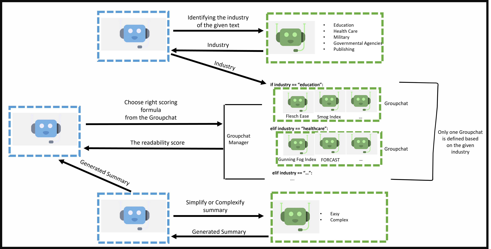

# The Readability Scoring Formulator
## Description
<p align="center">
  
  <br><br>
</p>
In a world inundated with textual information from diverse sources, ranging from research papers and articles to social media posts, the need for efficient, accurate, and automated text processing has never been more pronounced.

Readability Scoring Formulator is an innovative AI solution that revolutionizes the way text data is processed. It tackles the time-consuming and challenging task of classifying text into the appropriate industries, creating concise summaries, and assessing readability.

<br>

- Industry Classification: AutoGen's intelligent AI agents leverage state-of-the-art natural language processing techniques to accurately classify text documents into their corresponding industries. Whether it's news articles, financial reports, or social media content, our technology identifies the most relevant industry categories, saving time and resources.

<br>

- Text Summarization: The heterogeneity of text data demands flexibility in summarization. AutoGen goes beyond traditional summarization methods by generating two types of summaries for each document: one complex and one basic. This enables users to access both in-depth insights and quick overviews, catering to a wide range of preferences and needs.

<br>

- Readability Assessment: Assessing the readability of text is inherently subjective, and individual preferences and backgrounds play a significant role. AutoGen's advanced AI agents solve this challenge by providing readability scores tailored to the specific audience, enhancing the user's comprehension and engagement.


### Make a copy of the example OAI_CONFIG_LIST file for adding your OPENAI API key
```
## Linux
cp OAI_CONFIG_LIST.example OAI_CONFIG_LIST


## Windows
xcopy OAI_CONFIG_LIST.example OAI_CONFIG_LIST
```
